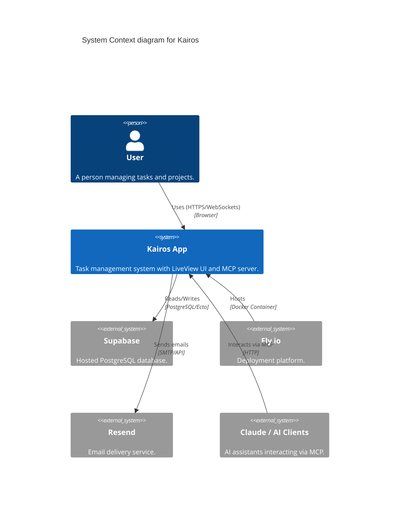

# Kairos

Self-hosted, open-source task management app. Todoist replacement with built-in MCP server for AI access via Claude.

## Architecture Overview



See `docs/architecture.md` for full design decisions, ERD diagrams, and sequence flows.

## Stack

- **Elixir + Phoenix 1.8.5 + LiveView 1.1** — backend + UI in one app
- **Tailwind + Salad UI + Heroicons** — styling and components
- **Ecto + Supabase PostgreSQL** — database (Supabase as hosted Postgres only)
- **`phx.gen.auth`** — authentication
- **Phoenix PubSub** — real-time updates
- **`hermes_mcp`** — MCP server over HTTP at `/mcp`
- **Fly.io** — single-app deployment

See `docs/architecture.md` for full design decisions.

## Local Development

**Prerequisites:** Elixir, Node.js, Docker

Start local Postgres:

```bash
docker compose up -d
```

Install deps and set up DB:

```bash
mix deps.get
npm install --prefix assets
mix ecto.setup
```

Run dev server:

```bash
mix phx.server
```

App at `http://localhost:4000`.

## Environment Variables

**Dev** — configured in `config/dev.exs`, points to local Docker Postgres. No `.env` needed.

**Prod:**

```
DATABASE_URL       # Supabase PostgreSQL connection string
SECRET_KEY_BASE    # Phoenix secret key (mix phx.gen.secret)
PHX_HOST           # Production hostname (e.g. kairos-app.fly.dev)
```

## Running Tests

```bash
mix test
```

## Deploy

```bash
fly deploy
```

## MCP Access

MCP server runs at `https://<host>/mcp`. Authenticate with a bearer token. Compatible with Claude Desktop and Claude Code.

## Gantt (Phase 2)

Dependency visualization via frappe-gantt, mounted as a Phoenix JS hook.
