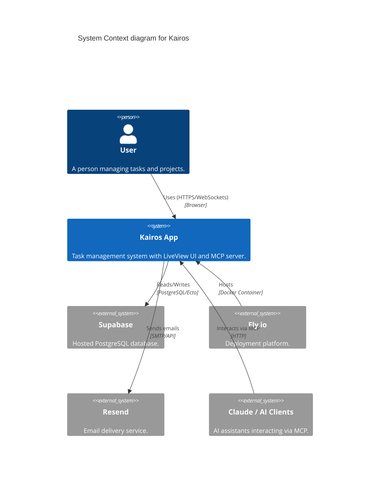
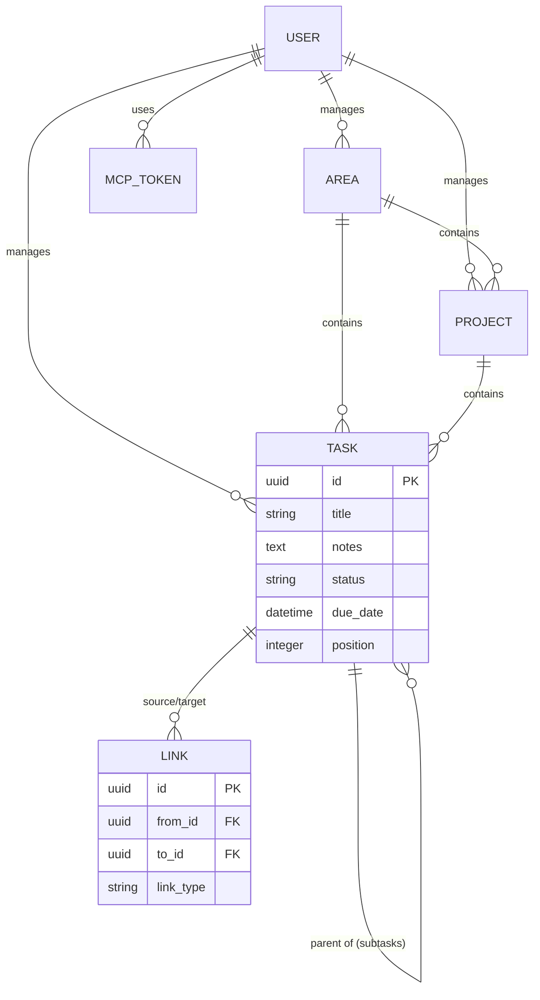
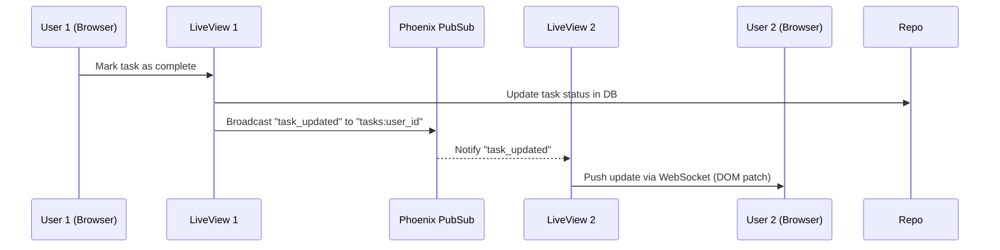

# Kairos — Architecture

Self-hosted, open-source task management app. Todoist replacement with built-in AI (MCP) access.

---

## System Overview

### System Context



---

## Stack

| Layer | Choice |
|---|---|
| Language | Elixir 1.18 / OTP 27 |
| Framework | Phoenix 1.7 + LiveView |
| UI | HEEx + LiveView + Tailwind + Salad UI |
| Icons | Heroicons (Phoenix built-in) |
| Gantt | frappe-gantt via Phoenix JS hook |
| Database | Supabase hosted PostgreSQL |
| ORM | Ecto 3 + Postgrex |
| Auth | `phx.gen.auth` (Postgres-backed) |
| Email | Resend via Swoosh |
| Real-time | Phoenix PubSub + LiveView |
| MCP | `hermes-mcp`, HTTP transport |
| Testing | ExUnit + DataCase |
| Deploy | Single Fly.io app (Phoenix release) |

---

## Domain Model

### Entities & Relationships (ERD)



### Entities

- **Area** — top-level container (Work, Home, Personal)
- **Project** — belongs to Area or unassigned; never Inbox
- **Task** — belongs to Inbox, Area, or Project (exclusive)
- **Subtask** — child of Task; max depth 1 (hard rule)
- **Link** — dependency between any two entities

### Domain Rules

| Rule | Enforcement |
|---|---|
| Task belongs to exactly one of: Inbox, Area, Project | DB constraint + context guard |
| Subtasks cannot have children | Context guard, returns `{:error, :max_depth}` |
| Task→Project promotion: subtasks become project tasks | `Tasks.promote_to_project/1` |
| Project→Task demotion: blocked if any task has subtasks | `Projects.demote_to_task/1` returns `{:error, :has_subtasks}` |
| Self-links forbidden | Context guard |
| `blocks`/`blocked_by` auto-creates inverse | `Links.create_link/1` |
| `related_to` is symmetric | `Links.create_link/1` |

---

## Real-time Architecture

LiveView handles real-time natively via PubSub. When a change occurs in one client, it is broadcasted to all other active sessions for that user.



---

## 3rd Party Services & APIs

### Infrastructure
- **Fly.io**: Primary hosting provider. Runs the Phoenix application as a Dockerized release in the `fra` (Frankfurt) region.
- **Supabase**: Managed PostgreSQL hosting. Used for all application data, including authentication and full-text search.

### External APIs
- **Resend**: Used for transactional emails (sign-up verification, password resets). Integrated via `Swoosh.Adapters.Resend`.
- **MCP (Model Context Protocol)**: Exposes a set of tools for AI assistants (like Claude) to interact with the application data.

### Frontend Libraries
- **frappe-gantt**: JavaScript library for rendering the Gantt chart in Phase 2. Integrated via Phoenix JS Hooks.
- **Salad UI**: A collection of accessible UI components built on top of Tailwind CSS and Phoenix LiveView.
- **Heroicons**: Standard icon set provided by Tailwind Labs, integrated via Phoenix core components.

---

## Deployment Details

### Build Process
The application is built using a multi-stage `Dockerfile` that produces a minimal Elixir release image.
1. **Build Stage**: Installs Elixir, Node.js (for assets), compiles the application, and builds assets.
2. **Release Stage**: Copies the compiled release into a clean Debian-slim image.

### Environment Variables
| Variable | Description | Source |
|---|---|---|
| `DATABASE_URL` | Supabase PostgreSQL connection string | Supabase |
| `SECRET_KEY_BASE` | Phoenix session/cookie secret | Generated |
| `PHX_HOST` | Production hostname (e.g., `kairos-app.fly.dev`) | Fly.io |
| `RESEND_API_KEY` | API key for Resend email service | Resend |
| `PORT` | Port the server listens on (default 8080) | Fly.io |

### Deployment Command
Deployment is handled via the Fly CLI:
```bash
fly deploy
```
This command triggers a remote build, runs migrations (via `release_command` in `fly.toml`), and performs a rolling update of the application instances.

---

## Project Management & Compliance

The project follows a structured 15-step development process, tracked via the **Kairos project management system** (this application itself, via its MCP server).
- **Project ID**: Defined in `kairos.id`
- **Logging**: Integrated with a centralized Logger API for production observability (optional).
- **Standards**: Strict adherence to semantic commits and comprehensive test coverage (90%+ threshold).
